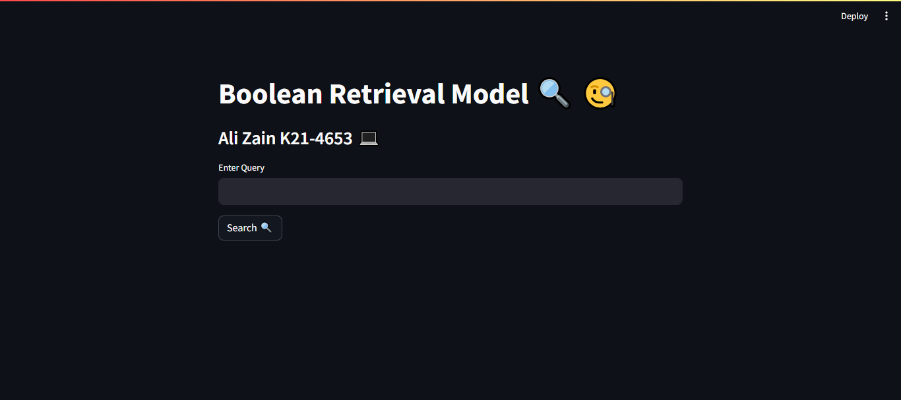
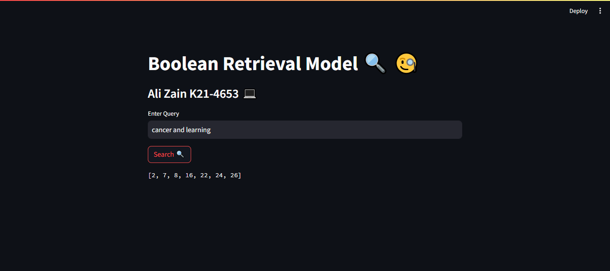
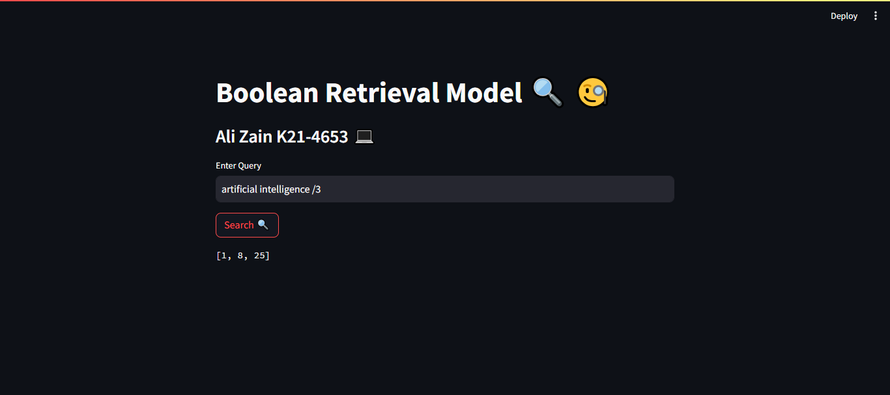

## Assignment 1: Boolean Retrieval Model 🔍🧐

#### Required Libraries 
  1. Streamlit
  2. Natural Language ToolKit

#### Install Libraries
1. <code> pip install streamlit </code>
2. <code> pip install nltk </code>

#### Execute the project
- Open the Terminal / Command Prompt
- Type <code> streamlit run 1_🏠_Home.py (press 1 then press tab) </code> on Terminal
- Search http://localhost:8501/ on browser
  

### Interface

### Inverted Index Boolean Query Processing

### Positional Index Proximity Query Processing

## Assignment 2: Vector Space Model 🚀📡

### HEHEHEHE 😉 

### Surprise 🎁
